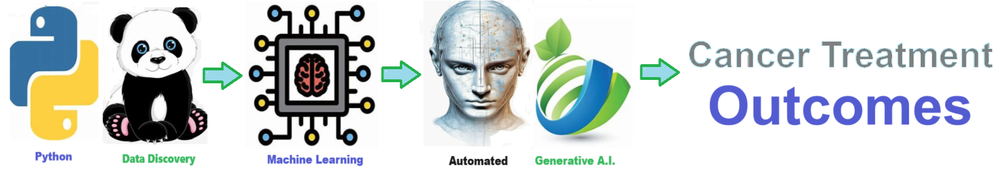
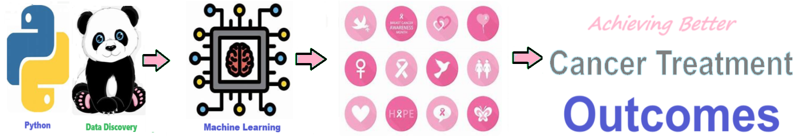

# Cancer Treatment Outcomes - Provides a list of measurable outcomes for Cancer Care including remission, ongoing treatment, active surveillance, death, etc.  
Provides a list of measurable outcomes for Cancer Care including remission, ongoing treatment, active surveillance, death, etc.  

Analysis of **cancer treatment outcomes** involves assessing various parameters such as remission rates, cancer-free survival, ongoing surveillance, and mortality rates. Remission indicates a temporary or permanent absence of cancer signs and symptoms, often achieved through successful treatment. Cancer-free survival refers to the duration without any evidence of cancer recurrence following treatment, highlighting the effectiveness of interventions in preventing disease progression. Ongoing surveillance involves regular medical monitoring to detect any potential cancer recurrence or development of new tumors, ensuring timely intervention if needed. Mortality rates provide insights into the overall effectiveness of treatments in reducing the risk of death from cancer. By analyzing these outcomes, healthcare professionals can evaluate the impact of treatment strategies, tailor interventions to individual patient needs, and continuously improve cancer care protocols.

A **cancer care timeline** begins with the screening process or first diagnosis. If any abnormalities or issues are detected, the next step is the diagnosis, where the presence and type of cancer are confirmed. Following diagnosis, the patient is referred to an oncology specialist. The timeline then tracks the period of treatment planning, which includes further testing and consultations to develop a personalized treatment strategy. Once the treatment plan is in place, the patient undergoes the prescribed treatment, which may involve surgery, chemotherapy, radiation, or other therapies. After treatment, the patient enters a phase of follow-up care, where their progress is regularly monitored. The timeline concludes with one of three outcomes: remission, where no signs of cancer are detected and periodic monitoring continues; watchful waiting, where the patient is actively monitored without immediate treatment for slow-growing cancers; or end-of-life care, where palliative care is provided when treatment is no longer effective, leading up to the patient's death.

 ## Cancer Treatment Outcomes 
 1. **Cancer-free** - The absence of detectable cancer cells in the body following successful treatment, indicating complete remission. 
  2. **Remission** - A period during which the signs and symptoms of cancer are reduced or absent. Remission can be partial (some cancer cells remain) or complete (no evidence of cancer). 
  3. **Ongoing treatment** - The patient continues to receive active cancer treatment, such as chemotherapy, radiation therapy, or immunotherapy, to control or manage the disease. 
  4. **Hospice** - End-of-life care provided to patients with advanced cancer who are no longer receiving curative treatment. Hospice care focuses on comfort and quality of life. 
  5. **Death** - The patient has succumbed to cancer or cancer-related complications. 
  6. **Ongoing surveillance** - Regular monitoring of cancer survivors for signs of disease recurrence or late effects of treatment, typically through medical exams, imaging tests, and blood tests. 
  7. **Disease progression** - The cancer has worsened or spread despite treatment, indicating treatment failure or resistance. 
  8. **Survivorship** - The period following cancer treatment when the patient transitions from active treatment to regular follow-up care. Survivorship focuses on maintaining physical and emotional well-being. 
  9. **Quality of life** - The overall well-being and satisfaction with life experienced by cancer patients, including physical, emotional, social, and functional aspects. 
  10. **Symptom management** - Efforts to alleviate and control cancer-related symptoms, such as pain, nausea, fatigue, and depression, to improve the patient's comfort and quality of life. 
  11. **Palliative care** - Specialized medical care focused on providing relief from the symptoms, pain, and stress of a serious illness like cancer. Palliative care aims to improve the quality of life for both the patient and their family, regardless of the stage of the disease or the need for other treatments. 
  12. **Adjuvant therapy** - Additional cancer treatment given after the primary treatment, such as surgery or chemotherapy, to kill any remaining cancer cells and reduce the risk of cancer recurrence. Adjuvant therapy aims to improve the long-term outcome and survival rate of cancer patients. 
  13. **Recurrence** - The return of cancer after a period of remission or absence, indicating that the disease has come back. 
  14. **Secondary cancer** - The development of a new cancer unrelated to the original cancer diagnosis, either in the same organ or a different part of the body. Secondary cancers may occur as a result of previous cancer treatments, genetic predisposition, or environmental factors. 
  

## Getting Started
To get started with the **Cancer Treatment Outcomes** solution repository, follow these steps:
1. Clone the repository to your local machine.
2. Install the required dependencies listed at the top of the notebook.
3. Explore the example code provided in the repository and experiment.
4. Run the notebook and make it your own - **EASY !**
    
## Solution Features
- Easy to understand and use  
- Easily Configurable 
- Quickly start your project with pre-built templates
- Its Fast and Automated

## Notebook Features
- **Self Documenting** - Automatically identifes major steps in notebook 
- **Self Testing** - Unit Testing for each function
- **Easily Configurable** - Easily modify with **config.INI** - keyname value pairs
- **Includes Talking Code** - The code explains itself 
- **Self Logging** - Enhanced python standard logging   
- **Self Debugging** - Enhanced python standard debugging
- **Low Code** - or - No Code  - Most solutions are under 50 lines of code
- **Educational** - Includes educational dialogue and background material
    
## Deliverables or Figures
       
    

## Github    https://github.com/JoeEberle/ 
## Email  josepheberle@outlook.com 

    

    